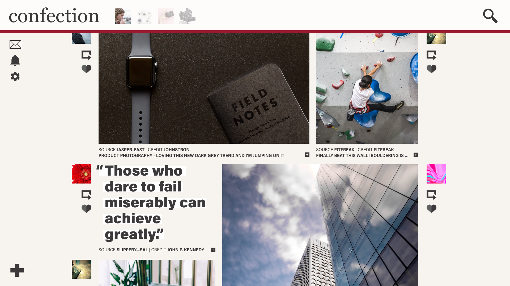
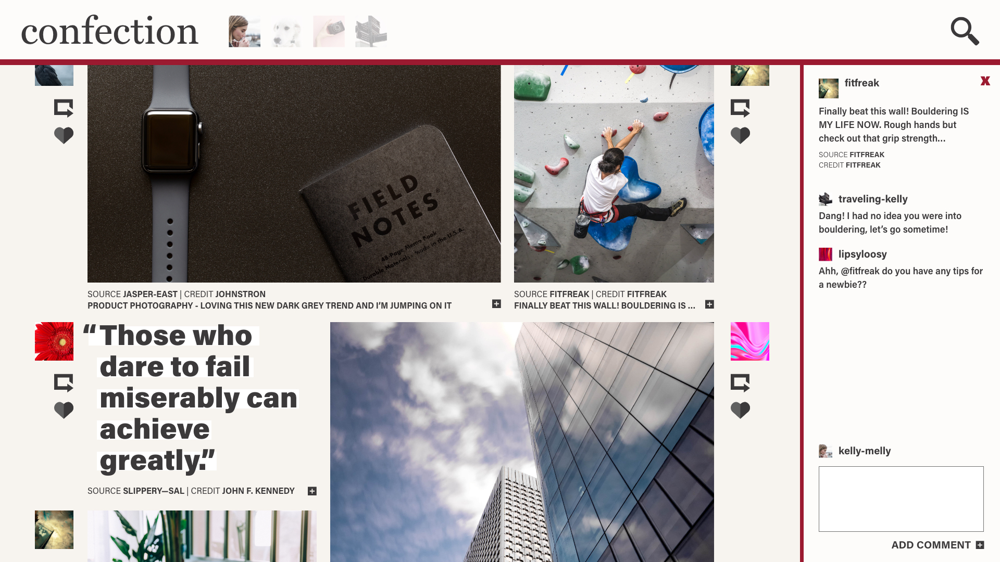
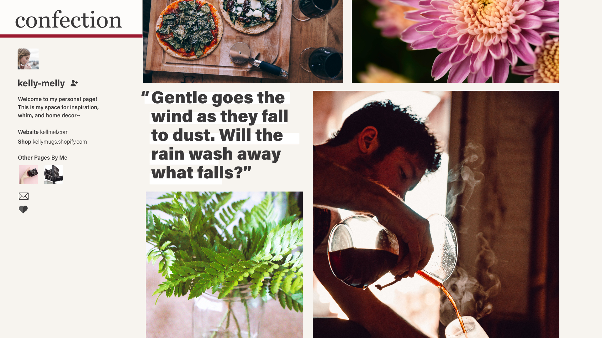
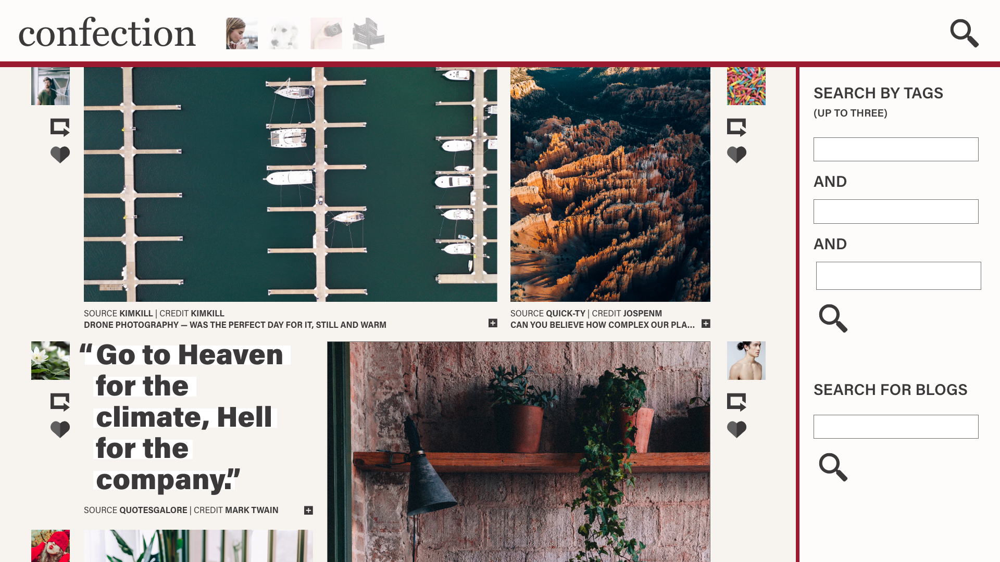
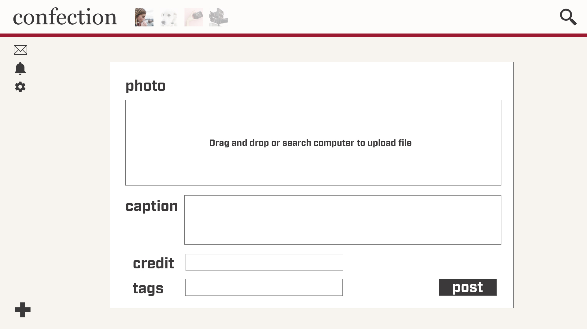
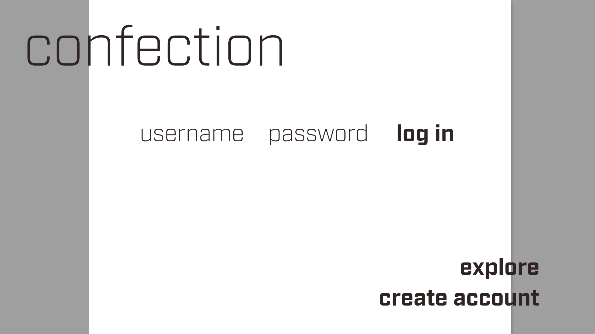

# <a href="https://confection-social.herokuapp.com/">Confection</a> Social App
Use frank@gmail.com / hellofrank, or create your own user to check out the site.

**Goal**

To create an application with an emphasis on community interactivity, artistic liberty, chronological feed, ease of use between accounts, and striking visual content.

=======================================================================================

**Team**
- <a href="https://github.com/camille-the-eel">Camille Hughes</a>
- <a href="https://github.com/mdreiling">Marshall Dreiling</a>

=======================================================================================

**Technologies Used**

- React
- Express
- Node
- MongoDB & <a href="https://www.mongodb.com/cloud/atlas">Atlas</a>
- Javascript
- CSS
- HTML
- <a href="https://jwt.io/">JSON Web Token</a>: user authentication
- <a href="https://www.npmjs.com/package/bcrypt">bcrypt</a>: password encryption
- <a href="https://www.npmjs.com/package/validator">validator</a>: validates account creation and log in input
- <a href="https://materializecss.com">Materialize CSS Framework</a>
- <a href="https://fonts.adobe.com/">Adobe Fonts</a>

=======================================================================================

**Build Status: In Development**

Current Features:
- user authentication/log in & out
- creating photo posts
- aggregated feed
- commenting
- explore all posts
- live commenting
- register multiple Pages on singular account

Features to Come: 
- functionality of additional registered Pages
- live notifications of activity, likes, rePaged conten
- creating text posts
- search by multiple tags
- explore trending posts
- private message center
- like list per Page
- update account settings and customization

=======================================================================================

**Motivation**

Major social media apps all have shortcomings corresponding to their structure. Twitter has a great community, but lacks visual appeal and support for photo-based content. Instagram has drawn wide criticism from their user base for their ranked feed algorithm and influx of sponsored/promoted content, in addition to limited community interaction. Tumblr's user base has moved on with the recent content restrictions and general influx in recent years of spam blogs.
Censorship in media has become prolific, and while content restriction is necessary to a certain level, there are few majorly used applications available to artists to share their work uncensored.

Our motivation was to address all of these inherent user concerns, and create one app that supports artist content, community growth and interaction, visibility of posted content regardless of account popularity, and unique to our application: the ability to create one account with multiple Pages, while the account remains unsearchable. The account holder acts through the app from the handle of their chosen Page. In essence, it is one account with multiple "users". The activity of each “user”/Page is aggregated to your account homepage. All of your followed content is aggregated to one feed, while the content you create or repage is specified to whichever ”user”/Page you decide. Pages are not linked unless the account sets the visibility to allow so. This gives account holders the ability to easily switch between "users" while still having all of their content and messaging in one place.

Let's give a real life example of this: 

Kelly is a professional photographer, travel blogger, and dog owner. 
She has one account under her specified email, and four Pages.

- Photography Page : posts her photography content and inspiration : mostly photo posts
- Travel Page : shares her travel journeys and tips and tricks of each city : mostly text posts
- Dog's Page : page for her pup, Kingpin, only posts doggie content : mostly photo posts
- Personal Page : personal interests, journaling : equal mix of photo and text posts

Using Confection, Kelly can easily view *all* the content she is interested in through her aggregated home Page, while also with a click of a button switch which user/Page she is acting under in order to create content, rePage, like, or comment on a post.

If you were to view her Photography Page, you would see in the sidebar a link to her Travel Tage and a link to her Dog's Page. However Kelly has not linked her personal page, and therefore there is no way for you to search for that Page through Kelly's account or any of her other unlinked Pages. It is entirely independent of the account and it's other Pages.

=======================================================================================

### Mockups & Wireframes

**Home Page Mockup** 

You can see the avatars of each Page this account has in the navbar. The active Page is full opacity while the rest of faded out. To switch which Page you are acting under, merely click the avatar you wish to act as. Clicking the active Page avatar will take you to that Page.

**Home Page with Comment Sidebar Activated**

**User Page Mockup** 

**Explore/Search Page Mockup**

**Create Post Wireframe**

**Log In Wireframe**

**Create Account Wireframe**

